# Spam Detection over Enron-Spam dataset

The repository contains the codes addressing the spam detection over [Enron-Spam](http://www2.isprs.org/commissions/comm3/wg4/2d-sem-label-vaihingen.html) dataset. In the first section, I briefly describe the dataset, pre-processing, classfication methods used, and the obtained results, in the second section, more details about implementation and the provided codes are given. 

# 1. Dataset, classifiacation methods

## 1.1 Dataset

Enron-Spam dataset includes non-spam (ham) messages from six Enron employess who had large mail boxes, and also it includes spam messages from four differnet sources namely: the SpamAssassin corpus, the Honeypot project, the spam collection of Bruce Guenter, and spam collected by the authors of the [paper](http://www2.aueb.gr/users/ion/docs/ceas2006_paper.pdf).


# 1.2 Pre-processing

In this project, I use spam and ham E-mails in thier raw format thus it is required to apply several pre-processing methods over the raw data to prepare it for feature extraction to obtain the features which will be used as input to the classifier.

The preprocessing can be summarized in the following list:
- All letters are converted to lower case.
- Only the body and the subject of the E-mail is preserved and used for classification, therefore lines which contain header information such as message-id, date,mime-version, etc are removed for the E-mail contents.
- HTML/JAVA inline commands and syntax are also removed from the contents as they are not useful for the spam detection.
- Any date, time, number, E-mail or website address are replaced with the word 'date', 'time', 'number', 'emailaddrs' or 'webaddrs'. The logic behind this pre-processing is that the actual E-mail or website address or a number or a date will not provide information for detecting spam E-mails, and if it does, it will be limited to this dataset and will not contribute to the genralization of classifier. For instance, if in this dataset spam contents are coming from a certain number of companies, then the classifier will be trained to detect spam based on the web address of these comapanies, however in real world application it might not include all types of spam. In addition, using generelized term such as 'emailaddrs' for all E-mail addresses will prevent the unnecessary increase of the vocabulary size.
- The punctuation marks are removed from the contents. 
- Stop words such as: whom, this, that, ... which can not provide useful information are also removed in pre-processing.
- To challenge the classification methods and their generalization capability, I also remove the most common words which are only present in one of the catagories (ham or spam), some of these words which are only present in ham E-mails are the name of Enron employees which the ham files are originated from,  or the words that are only seen in spam files are the name of the companies which have sent spam E-mails. Therefore, I decided to exclude these words to further challenge the classifiers and prevent overfitting on dataset.

- After applying these pre-processing, since there are multiple E-mails in both spam and ham classes, I removed the deuplicates by measuring the similarity of E-mails in each class, this similarity is measured by the fraction of identical lines to all the E-mail lines, I remove those duplicates with more than 90 % similarity. Removing duplicates is essential, since their presence increase the possibility that a duplicated sample falls into both training and test set which makes the classifier be prone to overfitting.


# 1.3 Feature extraction

After reading and pre-processing the E-mails contents in both spam and ham classes, tokenization is performed. Tokenization is the process of splitting the text to small parts called tokens. Here, tokens are words hence tokenization is the process of splitting the E-mail content into words.

Then, for all the classifiers except LSTM, I extract features using bag of words. Therefore, first, a vocabulary is constructed using contents in both ham and spam classes. Then, a number of most common words (512 words in our experiment) is selected as the words in the bag. For each E-mail in the dataset, the occurence of each word in the bag is counted for that E-mail. As a result, the data would be a two dimensional array as following:


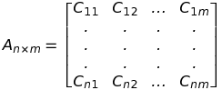

where `n` is the number of samples (E-mails) and `m` is the number of words in the bag, and `c_ij` is the number of j-th word in i-th sample.


However, in the case of LSTM, the features are extracted using another approach. Since LSTM can take as input, sequences of different lengths, our input dimension can vary over different samples.
Nevertheless, as before, tokenization is perform to split E-mail contents into words. Then, each word is indexed using a vocabulary, however this time I select much larger vocabulary (8000 words) as the words will mapped into a lower 512-dimensional embedding space. This embedding is also learned during the LSTM training such that the words which have similar semantic characteristics will be mapped into similar region in embedding space. Noentheless, these semantic characteristics will be defined by classifier during back-propagation. We will see the implementation details in the next parts.


# 1.4 Classifiacation

To perform classification, Multinomial Naive Bayes, K-Nearest Neighbor, Decision Tree, Logistic Regresion and LSTM classifers are used:

- **Multinomial Naive Bayes:** First classifaction approach is naive Bayes classifier, as its name implies it uses Bayes' theorem and with the assumption that the features (in our case selected words counts) are independent. Therefore, the probability that a sample belongs to a class `y` given its feature vectors `x_1 ... x_n` can be estimated usign Bayes' theorem:


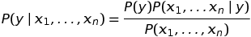


By the assumption, the features are independent, hence:


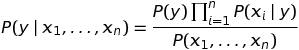


The class of a sample can be estimated as following:

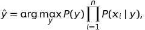


We used multinomial naive Bayes classifer where the probability distrution of each feature given the class:

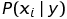


follows the multinomial distribution. Hence, the probability of a feature (in our case the coutn of a word in the bag) given the sample class (e.g. spam) is the number of times that features appeared in the samples of that class divided by total count of all features for that class.


- **Decision Tree:** Second classifer is decision tree, in decision tree method, a flow-chart structure (tree) is constructed where each internal node assigned a test/rule on a feature, the two outgoing branches represnt the outcome of that test (true or flase) and in the end the leaf nodes determine the class of the data. During the trainig, these rules and their corresponding threshold are learned by a criterion whether by minimizing gini or entropy according to the representation of the tree.


- **K-Nearest Neighbors:** The main idea behind nearest neighbor classifer is to find a number of training samples closest in distance to the test sample point, and predict the label from these training samples usually by measuring standard Euclidean distance. This approach can be regarded as non-generalizing machine learning method, since they simply memorize all of its training data during inference. The label of a sample in test set is usually defined by the majority vote of its k-nearest training samples label.


- **Logistic Regression:** Logistic regression is a linear classification model in which the probabilities are predicted using logistic function such as sigmoid. 
Therefore, first a linear model in applied over the input vector:


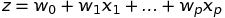


Then, the sigmoid functions will be used on the output:

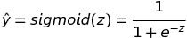


Therefore:

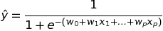


During training, weghit wectors `w_0 ... w_p` are optimized by minimizing cross entrop loss between the output `y` and the groundtruth `p` (`p` is zero or one):


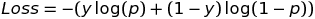

The loss can be back-propagated to the model weigths, where an optimization strategy is used to optimized weights based on loss gradient w.r.t weights.

- **LSTM:** Long Short Term Memory (LSTM) network is a special type of recurrent neural networks which can learn long-term dependencies in the input data. LSTM networks have been used in many applications regarding time series and sequence data and are able to learn and remeber information for long periods of time. They achieve this by using a set of gates such as input and forget gates. These gates use a non-linear function such as sigmoid to choose whether remember a part of the information or suppress it. Moreover, recurrent cells hidden and cell state which is fed into the next timestamps further improves the LSTM networks performance:


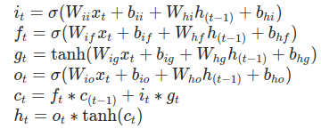


Where `h_t` and `c_t` used as input for the next timestamp and in the case of stacked LSTM, one cell outputs are used as input to the next layer LSTM cell. LSTMs networks such as common neural networks are trained by minimizing a loss function and using an optimization strategy. 


# 3. Results

Results are given in the terms of accuracy, presicion, recall, F1-score and also ROC curves for all classifiers.
It should be noted that all these classification methods can further be improved by doing a grid search over their hyper parameters. For instance, in case of K-NN, it is expected to obtain different results by chosing different values for `n`, or in the case of decision tree classifier, the results would vary by chosing different criterion such as entropy to measure the quality of split at internal nodes. Also the size of vocabulary (number of words in the bag) plays an important role in the performance. However, the purpose here is to provide a simple comparison between these different classifiers.


In the following table the performance metric are given over the test set for the spam class:


| Method        	| Accuracy [%]  | Precision [%] | Recall  [%] 	| F1-Score  [%] |
|-----------------------|:-------------:|:-------------:|:-------------:|--------------:|
| Naive Bayes   	|   93.18	|  95.99	|  90.14	|  92.97	|
| Decision Tree 	|   95.16    	|  94.58  	|  95.82	|  95.20	|
| K-Nearest Neighbors 	|   73.21    	|  65.18   	|  99.71	|  78.83	|
| Logistic Regression 	|   97.34    	|  95.90   	|  98.91	|  97.38	|
| LSTM 			|   98.16    	|  98.18   	|  98.15	|  98.17	|

As can be seen from the results, the LSTM performs the best. It can be expected, since the bag of words is used for other methods, it discards the words order in the contents. However LSTM can extract the dependencies between the words as the sequences are provided in a ordered manner using word embedding.Next, ROC curves for different classifiers are shown in the following plot, note that for better illustration, the plot show top right corner of the curves:


The decision tree and K-nearest neighbors classifier are not probabilistics methods meaning that the outcome of these classifiers are the labels not probability. However, in the decision tree the probability can be provided as the fration of samples in the leaf to all the samples of the same class. For the K-nearest neighbor, the probability can be computed measuring by the fraction of the nearest neighbor with the same class to all n-nearest neighbor. Hence, for decision tree and K-nearest neighbor, ROC curves are not present in all the ranges. Here, again LSTM provide better performance as for lower false positive rates it has higher true positive rate.


# 2. Implementation

The codes organized as following : 
-  The main file `main.py` used to apply classification and measure the performance.
-  The file `EnronDataset.py` contains:
	- Class `EnronLoader` to read and pre-process E-mail contents.
	- Class `EnronBatchLoader` returns an iterable object to be used for mini-batch loading during training/testing neural networks.
- The file `utilities.py` includes usefull functions for contents analysis and also measuring classification performance.
- The file `LogisticRegression.py` implement `ClassifierLogisticRegression` class for Logistic Regression Classifier.
- The file `LSTM.py` implement `ClassifierLSTM` class for Long Short-Term Memory networks.


The methods used for spam classification are : Decision Tree, Multinomial Naive Bayes, K-Nearest Neighbors classifiers (scikit-learn) and also Logistic Regression and LSTM (PyTorch).
For extracting the features for all classifiers except LSTM, we use bag of words method in which we selected a number of most common words in E-mails (after pre-processing), and for each E-mail in the dataset we count the number of selected words in that E-mail hence our data would be two dimentional array where the number of rows is the number of samples and the number of columns is the number of select words (words in the bag). However, as we will see in the next parts, since LSTM can takes sequence input of different sizes, we use word embedding techniuqe for extracting features for LSTM calssifier.

The classifcation performance is measured using accuracy, precision, recall, and f1-score for both spam and ham classes as well as RoC curves for all classifiers.

But, first of all, to classify E-mails to spam and ham classes, we pre-process the raw E-mails using `EnronLoader` class as following:


# 2.1 Pre-processing


The goal of this project is to detect whether an E-mail is spam or not (ham) solely based on the content and the subject. Therefore, in pre-processing stage we remove all other parts of an email except subject and the body or the content. For reading and preprocessing the raw Enron-spam dataset, `Class EnronLoader` is provided in `EnronDataset.py`.


```python

class EnronLoader(object):
	def __init__(self,**kwargs):
		spamDir = kwargs.get('spamDir')
		hamDir  = kwargs.get('hamDir')
		if spamDir == None or hamDir == None:
			raise NameError("the directory containing ham and spam should be provided")
		self.spamFiles = self._filesToBeRead(spamDir)
		self.hamFiles  = self._filesToBeRead(hamDir)

		# Punctuation marks to be removed
		self.punctuation_marks = ['!', '"', '#', '$', '%', '&', "'", '(', ')', '*', '+', ',', '-', '.',\
		'/', ':', ';', '<', '=', '>', '?', '@', '[', '\\', ']', '^', '_', '`', '{', '|', '}', '~','\t']
		# list of stop words
		self.stopwords_list = stopwords.words('english')
		# Lines including the header words will be eliminated
		self.header_words = ['message-id:', 'date:', 'from:','sent:', 'to:','cc:','bcc', 'mime-version:', 'content-type:', \
		'content-transfer-encoding:', 'x-from:', 'x-to:', 'x-cc:', 'x-bcc:', 'x-origin:', 'x-filename:', 'x-priority:', 'x-msmail-priority:',\
		'x-mimeole:','return-path:','delivered-to:','received:','x-mailer:','thread-index:','content-class:','x-mimeole:','x-originalarrivaltime:',\
		'charset=','http://','by projecthoneypotmailserver','--=','clamdscan:','error:','alias:','=_nextpart_','href=','src=','size=','type=']
		# Words in the following list will be removed to avoid words which are only presented in one class (ham or spam) (distinctive words) 
		self.distinctive_words = ['hou','kaminski', 'kevin', 'ena','vince', 'enron','stinson','shirley','squirrelmail','ect','smtp','mime','gif',\
		'xls','mx','louise','ferc','ppin', 'wysak', 'tras', 'rien', 'saf', 'photoshop', 'viagra', 'cialis', 'xual', 'voip',\
		'dynegy', 'skilling', 'mmbtu', 'westdesk', 'epmi', 'fastow', 'bloomberg','ist', 'slashnull', 'xp', 'localhost', 'dogma',\ 			'authenticated','ees','esmtp','john','fw','postfix','xp','3a','steve','cs','mike','macromedia','http','secs', 'futurequest','scheduling']
		# if the number of words exceeded maxContentLength, trunk the content
		self.maxContentLength = kwargs.get('maxWords',1000)
```
To initilize the class, two keywords arguments `spamDir` and `hamDir` should be provided which locates the raw files belonging to spam and ham E-mails. Moreover, the punctuation marks is provided which will be removed from the content as they are not usefull for classification and take space in the vocabulary. ` header_words ` is the list of words indicating the lines in the E-mail which are not body and the subject such as 'message-id:' and 'date:'. To challenge the classification methods and their generalization capability, I also remove the most common words which are only present in one of the catagories(ham or spam), some of these words which are only present in ham E-mails are the name of Enron employees which the ham files are originated from,  or the words that are only seen in spam files are the name of the companies which have sent spam E-mails. Therefore, I decided to exclude these words to further challenge the classifiers and prevent overfitting on dataset. In the next part, we will see how these distintive words are chosen.

```python
class EnronLoader(object):
	.
	.
	.

	def _filesToBeRead(self,path):
	# function to return list of all files in leaves given a root tree directory
		fileList = []
		for root,dirs,files in os.walk(path):
			if len(dirs) == 0: 	# leaves : containing the files
				for f in files:
					fileList += [os.path.join(root,f)]
		return fileList

	def readHam(self):
		print('\n'+'*'*5 + 'reading ham files' + '*'*5)
		content = self._preprocess(self.hamFiles)
		return content

	def readSpam(self):
		print('\n'+'*'*5 + 'reading spam files' + '*'*5)
		content = self._preprocess(self.spamFiles)
		return content

```

The class `EnronLoader` also includes a method `_filesToBeRead(self,path)` which returns the list of files given the root directory. Methods `readHam(self)` and `readSpam(self)` are used to read and preprocess all the files in `spamDir` and `hamDir` using  `preprocess` method.


```python
class EnronLoader(object):
	.
	.
	.

	def _preprocess(self,files_list):
		content_list=[]
		numOfFiles = len(files_list)
		for (num_file,File) in enumerate(files_list):
			print("Reading and pre-processing content [% 5d / %d] : %s" % (num_file+1,numOfFiles,File),end="\r")
			f = open(File,'r',encoding="ISO-8859-1")
			content = f.read()
			f.close()
			# Some Preprocessing over the content : 
			# 1. Converting all letters to lower case
			content = content.lower()
			# 2. Splitting the content based on lines, and removing fields except body and subject
			cleanedContent=""
			for line_num,line in enumerate(content.split("\n")):
				for word in self.header_words:
					if word in line: # if word in line , we don't want that line
						break
					elif word == self.header_words[-1]: # if word not in line and we check all the words, we  want that line
						cleanedContent += (line + "\n ")		
			content = cleanedContent				
			# 3. Get rid of HTML commands, replacing them with space 
			content	= re.sub(">(.|\n)*?</","",content)
			content	= re.sub("{(.|\n)*?}","",content)
			content	= re.sub("<.*?>","",content)
			content = re.sub("&.*?;","",content)
			content	= re.sub("=[0-9]*","",content)		

			# 4. Replace E-mail address with word "emailaddrs" 
			#       and Website address with word "webaddrs"
			cleanedContent=""
			for word in content.split():
				if "@" in word:
					cleanedContent += "emailaddrs "
					continue
				if ("http:" in word) or (".com" in word):
					cleanedContent += "webaddrs "
					continue					
				cleanedContent += word + " "
			content = cleanedContent

			# 5. Replace dates and time with 'date' and 'time'
			content = re.sub(" [0-9]{2}/[0-9]{2}/[0-9]{4} " ," date ",content) 
			content	= re.sub(" [0-9]{1,2}:[0-9]{2} ",' time ',content)

			# 6. Replace punctuation characters with space
			cleanedContent =""
			for char in content:
				if char in self.punctuation_marks:
					cleanedContent += " "
				else:
					cleanedContent += char
			content = cleanedContent

			# 7. Replace number with the text "number"
			cleanedContent=""
			for word in content.split():
				if word.isdigit():
					cleanedContent += "number "
					continue					
				cleanedContent += word + " "
			content = cleanedContent

			# 8. Replace multiple consecutive spaces
			content = re.sub(" +"," ",content)

			# 9. Removing stop words and distinctive words
			WordsToBeRemoved = self.stopwords_list + self.distinctive_words
			cleanedContent=""
			for word in content.split():
				#print(word)
				for word_toBRem in WordsToBeRemoved:
					if word == word_toBRem: # we don't want this word
						break
					elif word_toBRem == WordsToBeRemoved[-1]:
						cleanedContent += (word + " ")
			content = cleanedContent
			
			# 10. Removing words with length smaller than 1 and bigger than a max
			cleanedContent = " ".join([word for word in content.split() if ( len(word) > 1 and len(word) < 40)])
			content = cleanedContent
			# 11. Trunk the content if number of words exceeded a max
			if len(content.split()) > self.maxContentLength:
				shorten_content = " ".join(content.split()[:self.maxContentLength])
				content = shorten_content
			# 12. Skipping E-mails with empty content after pre-processing
			if len(content) < 1:
					continue
			content_list += [content]
		return content_list
```

The `preprocess` method read and process the raw content from a list of files using in 12 steps: first we convert all letters to lowercase, then lines that contain E-mail header such as message-id:, date:, from:, etc are removed form the content preserving only body and the subject. In third step, regular expression are used to remove HTTP syntax as they will not contribute to the classification. In the following in step 4, 5, and 7 we replace any E-mail or Website address or any time and date or number with the words : 'emailaddrs' , 'webaddrs' , 'time', 'date, and 'number' respectively.
The logic behind this pre-processing is that the actual E-mail or website address or a number or a date will not provide information for detecting spam E-mails, and if it does, it will be limited to this dataset and will not contribute to the genralization of classifier. For instance, if in this dataset spam filters are coming from a certain number of companies, then the classifier will be trained to detect spam based on the web address of these comapanies which in real application it might not include all types of spam. In addition, using generelized term such as 'emailaddrs' for all E-mail addresses will prevent the unnecessary increase of the vocabulary size.
In the next lines of code, the punctuation marks, mutiple cosecutive spaces are eliminated from the content. 
Stop words such as: whom, this, that, ... which can not provide useful information are also removed in pre-processing. 
After these cleaning attempts, there might remained some meaningless one character words or very long words, therefore we remove these words by setting boundary for word length.
In the next part, there might be E-mails that after preprocessing do not include any words which will not be considered. In the other hand, some E-mails contain a huge number of words, as we will see in the next part, to prevent very large input demension for LSTM classifier, we set a upper bpundary for number of words in the E-mail, E-mail which exceed this boundary will be truncated.

The following is the histogram of number of words in both spam and ham folders after applying the preprocessing.
As can be seen the emials which are truncated at 1000 words are very small portion of the data (less than 1 %) hence we will not loss information by setting boundary on number of E-mail words.

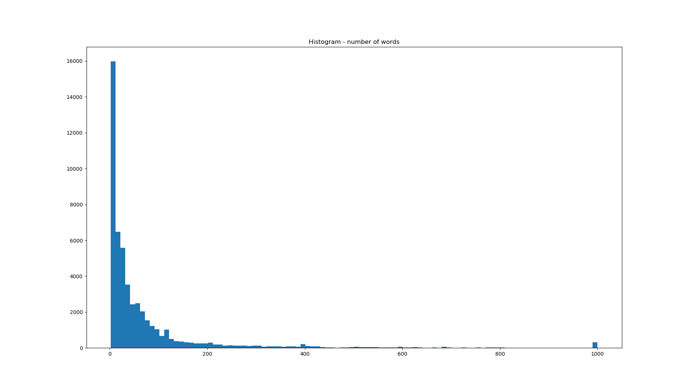


# 2.2 Data loader for LSTM and logistic regression classifier

`EnronBatchLoader` is a iterator provided in `EnronDataset.py` to iterate over pre-processed Enron dataset to be used while training/testing logistic regression and LSTM networks.


```python
class EnronBatchLoader():
	def __init__(self, **kwargs):
		self.batchSize 	= kwargs.get('batchSize')
		self.data 	= kwargs.get('data')
		self.label 	= kwargs.get('label')
		self.seqLengths = kwargs.get('seqLengths')
		self.LSTM       = kwargs.get('LSTM',False)
		# check the inputs
		if not isinstance(self.batchSize, int):
			print(type(self.batchSize))
			raise TypeError('batch size should be an integer')
		if not isinstance(self.data, type(torch.Tensor())):
			raise TypeError('data should be a tensor')
		if not isinstance(self.label, type(torch.Tensor())):
			raise TypeError('label should be a tensor')
		# if LSTM then we should return sequence length as well
		if self.LSTM :
			if not isinstance(self.seqLengths, type(torch.Tensor())):
				raise TypeError('seqLengths should be a tensor')
		self.size 	= self.label.size(0)
		self.shuffle	= kwargs.get('shuffle',False)	
	def _batchSampler_generator(self):
		# generator used to return a batch indexes using sampler
		batchIndexes = []
		for idx in self.sampler_index:
			batchIndexes.append(idx)
			if len(batchIndexes) == self.batchSize:
				yield batchIndexes
				batchIndexes = []
		if len(batchIndexes) > 0 :
			yield batchIndexes
	def __iter__(self):
		# when start iteration, this method will be called, reset the iterators
		# if shuffle then return a random permutation, if not just a range for sampler
		# batch sampler will be intialized with a generator 
		if self.shuffle:
			self.sampler_index = iter(np.random.permutation(self.size))
		else:
			self.sampler_index = iter(range(self.size))
		self._batchSampler = self._batchSampler_generator()
		return self
	def __next__(self):
		batchInd = next(self._batchSampler)
		batch_data = self.data[batchInd]
		batch_label = self.label[batchInd]
		if not self.LSTM: 
			return batch_data, batch_label
		else:
			batch_seqLengths = self.seqLengths[batchInd]
			batch_seqLengths, sorted_indexes = batch_seqLengths.sort(0, descending=True)
			batch_data = batch_data[sorted_indexes]
			batch_label = batch_label[sorted_indexes]
			return batch_data, batch_label, batch_seqLengths
	def __len__(self):
		return self.size
```

In `EnronBatchLoader`, batch size (integer), data (PyTorch Tensor), and label (PyTorch Tensor) are provided as keyword arguments,
nevertheless, when used as data loader for LSTM, it also takes sequence length as argument. The data loader in each iteration returns a mini-batch of data and labels (shuffled if shuffled is True) and if LSTM is ture also a batch of sequence length. For LSTM, it is required to sort data in each mini-batch based on sequence length such that the longest sequence should be first. This is necessary as we will see when we trained LSTM for sequences with different lengths.


# 2.3 Functions for text analysis and preformance metrics

In `utilities.py`, there are some useful functions which will be used in analysing text and also to measure the classification performance.


```python
def extractVocab(content):
	'''
	Takes content as arg,
	Returns vocabulary dictionary
	where keys are words and values are words count
	'''
	dict_vocab = {}
	content_splitted = content.split(" ")
	for word in content_splitted:
		if word in dict_vocab.keys():
			dict_vocab[word] += 1
		else:
			dict_vocab[word] = 1
	return 	dict_vocab

def wordCount(dict_vocab):
	'''
	Takes vocabulary dictionary as arg,
	Returns two list : 1. words  2. words count
	which are sorted based on words count
	'''
	words_sorted = []
	counts_sorted = []
	dict_vocab_counts = list(dict_vocab.values())
	dict_vocab_words  = list(dict_vocab.keys())
	sorted_index = sorted(range(len(dict_vocab_counts)),key = lambda x:dict_vocab_counts[x],reverse=True)
	for i in sorted_index:
		words_sorted  += [dict_vocab_words[i]]
		counts_sorted += [dict_vocab_counts[i]]
	return words_sorted,counts_sorted
```

`extractVocab` functions takes as argument a string and extract the words and their count of occurence in the string and returns a vocabulary dictionary where keys are words and values are the wrods count. `wordCount` is used to sort the words based on their counts given a vocabulary dictionary, it returns two lists: sorted words, and their count.


```python
def computeConfMatrix(predictions,labels):
	'''
	Takes predictions and labels
	as arg in shape of 1D array with size of num of samples
	Return Confusion matrix
	'''
	confusionMatrix = np.zeros((2,2))
	for i in range(len(predictions)):
		predicted = predictions[i]
		groundtruth = labels[i]
		confusionMatrix[predicted][groundtruth] += 1
	return confusionMatrix

def div(a,b):
	'''
	To prevent division by zero,
	Return 0 instead
	'''
	if b == 0:
		return 0
	else:
		return a/b

def performanceMetrics(confusionMatrix):
	'''
	Takes Confusion Matrix as arg (0: ham , 1:spam),
	Returns some performance matrix:
	accuracy, precision, recall, f1-Score, false positive rate, true positive rate
	and for both spam and ham class
	'''
	# For Ham Class
	TP_ham = confusionMatrix[0][0]
	TN_ham = confusionMatrix[1][1]
	FP_ham = confusionMatrix[0][1]
	FN_ham = confusionMatrix[1][0]
	acc_ham = div ((TP_ham + TN_ham) ,(TP_ham + TN_ham + FP_ham + FN_ham))
	precision_ham = div (TP_ham , (TP_ham + FP_ham))
	recall_ham    = div(TP_ham , (TP_ham + FN_ham))
	f1Score_ham   = div( 2 * precision_ham * recall_ham , (precision_ham + recall_ham) )
	FPR_ham =  div(FP_ham , (FP_ham + TN_ham))
	TPR_ham =  div(TP_ham , (TP_ham + FN_ham))
	# For Spam Class
	TP_spam = confusionMatrix[1][1]
	TN_spam = confusionMatrix[0][0]
	FP_spam = confusionMatrix[1][0]
	FN_spam = confusionMatrix[0][1]
	acc_spam = div((TP_spam + TN_spam) ,(TP_spam + TN_spam + FP_spam + FN_spam))
	precision_spam = div(TP_spam , (TP_spam + FP_spam))
	recall_spam    = div(TP_spam , (TP_spam + FN_spam))
	f1Score_spam   = div(2 * precision_spam * recall_spam , (precision_spam + recall_spam) )
	FPR_spam =  div(FP_spam , (FP_spam + TN_spam))
	TPR_spam =  div(TP_spam , (TP_spam + FN_spam))
	
	metrics = {'acc_ham':acc_ham  ,'precision_ham':precision_ham,'recall_ham':recall_ham,'f1Score_ham':f1Score_ham,'FPR_ham':FPR_ham,'TPR_ham':TPR_ham,\
		   'acc_spam':acc_spam,'precision_spam':precision_spam,'recall_spam':recall_spam,'f1Score_spam':f1Score_spam,'FPR_spam':FPR_spam,'TPR_spam':TPR_spam} 

	return metrics

def ROC(predictions_prob,labels):
	'''
	Takes prediction probabilities and actual ground truths (for spam class)
	as arg in shape of 1D numpy array with size of num of samples
	Returns false positive and true positive rate for a set of thresholds
	'''
	thresholds = np.arange(0,1,0.02)
	FPR = np.zeros(len(thresholds))
	TPR = np.zeros(len(thresholds))
	for (i,th) in enumerate(thresholds):
		# set threshold on probability along spam column: 0:ham, 1:spam
		predictions_th = (predictions_prob > th)*1 
		conf_th = computeConfMatrix(predictions_th,labels) 
		metrics_th = performanceMetrics(conf_th)
		FPR[i] = metrics_th['FPR_spam']
		TPR[i] = metrics_th['TPR_spam']
	return FPR,TPR
```

`computeConfMatrix` takes as argument predictions and groundtruth labels and it returns confusion matrix in which rows represent predicted class and columns represent the actual class.
`performanceMetrics` takes as argument the confusion matrix and it computes several metrics for both spam and non-spam classes including: accuracy, precision, recall, f1-score, false positive rate, and true positve rate and it returns the metrics in a python dictionary.
`ROC` takes as argument predictions probabilties (for spam class) and labels, by setting a threshold (from 0 to 1 by a step of 0.02) it computes the false and true positive rates to be used for ploting ROC curves.


# 2.4 LSTM Classifier


LSTM classifier is written using PyTorch library, in `LSTM.py` first we define the LSTM network structure in `NetworkLSTM` class using `nn.Module` as parent class.
```python

class NetworkLSTM(nn.Module):
	def __init__(self, **kwargs):
		super().__init__()
		outputSize = kwargs.get('outputSize',1)
		numLayers = kwargs.get('numLayers',1)
		self.hiddenSize = kwargs.get('hiddenSize',4)
		embedSize = kwargs.get('embedSize',4)
		vocabSize = kwargs.get('vocabSize',1000)
		dropout = kwargs.get('dropout',0.2)
		dropoutLSTM = kwargs.get('dropoutLSTM',0.2)
		self.device = kwargs.get('device','cpu')
		# embedding layer 
		self.embedding = nn.Embedding(vocabSize, embedSize)
		# LSTM Cells
		self.lstm = nn.LSTM(embedSize, self.hiddenSize, numLayers, dropout = dropoutLSTM, batch_first=True)
		# last layer fully connected and sigmoid layers
		self.dropout = nn.Dropout(dropout)
		self.fc = nn.Linear(self.hiddenSize, outputSize)
		self.sig = nn.Sigmoid()
	def forward(self, x, seqLengths):
		# x is a tensor with size of mini-batch size X max Sequence Lenght (other sequences are padded with zeros)
		# Ex: x : 32 X 3000 
		# embedding the input words
		embeddedOutputs = self.embedding(x)
		# embeddedOutputs has size of mini-batch size X max Sequence Lenght X embedding dimensions
		# Ex: embeddedOutputs : 32 X 3000 X 64
		# pack the input ( removing padding for the sequences with length smaller than max length)
		packedInput = pack_padded_sequence(embeddedOutputs, seqLengths.cpu().numpy(), batch_first=True)
		# packedInput includes :
		# 1. the packed input with size of 
		# (sum of all sequence lengths in the batch) X (embedding dimensions) , Ex: 50000 x 64
		# 2. And also it includes the batch size for each time (instance)
		# inputing the following data class to rnn, the rnn will input batches of different sizes, the sequence with maximum element will be in all batches and sequence with one element will only be in one batche therefore allowing training rnn with sequences of different lengths
		# Ex:
		# Hi  	John  	How 	things 	are 	going  
		# Hello	see	you	soon	-	-
		# Fine	-	-	-	-	-
		# [3	2	2	2	1	1]
		packedOutput, (ht, ct) = self.lstm(packedInput, None)
		# packedOutput includes data and batch sizes as well, output size is
		# (sum of all sequence lengths in the batch) X (hidden size)
		# unpacking the output and recover the paddings
		output, inputSizes = pad_packed_sequence(packedOutput, batch_first=True)
		# the output size : batch size X max seq length in the batch X hidden size
		# inputSizes = the length of samples in the batch
		# Get the index for last element for each sample in the batch
		lastWordIndexes = (inputSizes - 1).to(self.device) 
		lastWordIndexes = lastWordIndexes.view(-1, 1).unsqueeze(2).repeat(1, 1, self.hiddenSize)
		# for each sample in batch we want the output at the last element
		output = torch.gather(output, 1, lastWordIndexes).squeeze() # [batch_size, hidden_dim]
		output = self.dropout(output)
		output = self.fc(output).squeeze() 
		output = self.sig(output)
		return output
```

The LSTM network include an word embedding layer and lstm cells and fully connected layer. To compute the network output:


**First:** The input data is a tensor where the rows are samples in the mini-batch and the columns are the words, as all the E-mails don't have the same number of words,
We pick the maximum length as the number of columns. Therefore the sequences with words less than maximum length will be padded by zeros.


**Second:** The embeding layer will take as input the samples and it outputs the vectors in embedded domain, where each dimension in this domain has a semantic meaning for the classifer,
For instance, if we want to classify which object can eat, the words 'human' and 'animal' may be projected into the same region in this embedded domain. The embedding layer will outputs a vector for each word.

**Third** We don't want to train LSTM over zeros padded in the samples, `pack_padded_sequence` is used to remove those padded zeros from the samples.

**Forth** At last, We compute the outputs of the LSTM, and we select the last outputs for each sequence to be input to the fully connected layer for classification.


`LSTM.py` also includes `ClassifierLSTM` class as following:

```python
class ClassifierLSTM(object):
	def __init__(self,**kwargs):
		self.batchSize 	= kwargs.get('batchSize',256)
		self.device = kwargs.get('device','cuda')
		self.model = NetworkLSTM(**kwargs).to(self.device)
		self.criterion = nn.BCELoss()
		self.optimizer = torch.optim.Adam(self.model.parameters(), lr=0.001)

	def saveWeights(self,fileName):
		torch.save(self.model.state_dict(),fileName)

	def loadWeights(self,fileName):
		self.model.load_state_dict(torch.load(fileName))

	def train(self,loader):
		numMiniBatches = ceil(len(loader) / self.batchSize)
		self.model.train()
		for mini_batchNum , (minibatch_data,minibatch_label,minibatch_seqLength) in enumerate(loader):
			minibatch_data = minibatch_data.to(self.device)
			minibatch_label = minibatch_label.to(self.device)
			minibatch_seqLength = minibatch_seqLength.to(self.device)
			# get the output from the model
			output = self.model(minibatch_data, minibatch_seqLength)
			# get the loss and backprop
			loss = self.criterion(output, minibatch_label.float())
			self.optimizer.zero_grad() 
			loss.backward()
			# prevent the exploding gradient
			clip=5 # gradient clipping
			nn.utils.clip_grad_norm_(self.model.parameters(), clip)
			self.optimizer.step()
			print("Train : MiniBatch[%3d/%3d]   Train loss:%1.5f"  % (mini_batchNum,numMiniBatches,loss.item()),end="\r")
	def predict(self,loader):
		numMiniBatches = ceil(len(loader) / self.batchSize)
		self.model.eval()
		outputs = []
		predicted = []
		labels = []
		for mini_batchNum , (minibatch_data,minibatch_label,minibatch_seqLength) in enumerate(loader):
			minibatch_data = minibatch_data.to(self.device)
			minibatch_label = minibatch_label.to(self.device)
			minibatch_seqLength = minibatch_seqLength.to(self.device)
			output = self.model(minibatch_data, minibatch_seqLength)
			loss = self.criterion(output, minibatch_label.float())
			print("Val : MiniBatch[%3d/%3d]   Val loss:%1.5f"  % (mini_batchNum,numMiniBatches,loss.item()),end="\r")
			outputs += output.to('cpu').detach().numpy().squeeze().tolist()
			predicted += (output.to('cpu')>0.5).numpy().squeeze().tolist()
			labels += minibatch_label.to('cpu').numpy().astype(np.uint8).squeeze().tolist()
		return outputs,predicted,labels
```


`ClassifierLSTM` includes methods for training and testing the network as well as methods for saving and loading the networks weights.
`train` method iterate over our costum data loaders and compute the network outputs and the loss, then it optimizes the network weights based on a criterion (binary cross entropy) and optimization strategy (Adam).
`predict` method computes the network outputs and spam prediction and returns them. Also, since we have shuffled the inputs and labels during data iteration, we also return labels for computing performance metrics.


# 2.5 Logistic Regression


Similar to LSTM, `LogisticRegression.py` includes a class for defining the network using PyTorch library:

```python
class logisticRegressionNet(nn.Module):
	def __init__(self, **kwargs):
		super().__init__()
		inputSize = kwargs.get('inputSize',32)
		outputSize = kwargs.get('outputSize',1)
		self.device = kwargs.get('device','cpu')
		# Fully connected layer
		self.fc = nn.Linear(inputSize, outputSize)
		self.sig = nn.Sigmoid()
	def forward(self, x):
		output = self.fc(x).squeeze() 
		output = self.sig(output)
		return output
```

And also it includes `ClassifierLogisticRegression`:

```python
class ClassifierLogisticRegression(object):
	def __init__(self,**kwargs):
		self.batchSize 	= kwargs.get('batchSize',256)
		self.device = kwargs.get('device','cpu')
		self.model = logisticRegressionNet(**kwargs).to(self.device)
		self.criterion = nn.BCELoss()
		self.optimizer = torch.optim.Adam(self.model.parameters(), lr=0.005)

	def saveWeights(self,fileName):
		torch.save(self.model.state_dict(),fileName)

	def loadWeights(self,fileName):
		self.model.load_state_dict(torch.load(fileName))

	def train(self,loader):
		numMiniBatches = ceil(len(loader) / self.batchSize)
		self.model.train()
		for mini_batchNum , (minibatch_data,minibatch_label) in enumerate(loader):
			minibatch_data = minibatch_data.to(self.device)
			minibatch_label = minibatch_label.to(self.device)
			output = self.model(minibatch_data)
			loss = self.criterion(output, minibatch_label.float())
			self.optimizer.zero_grad() 
			loss.backward()
			self.optimizer.step()
			print("Train : MiniBatch[%3d/%3d]   Train loss:%1.5f"  % (mini_batchNum,numMiniBatches,loss.item()),end="\r")
	def predict(self,loader):
		numMiniBatches = ceil(len(loader) / self.batchSize)
		self.model.eval()
		outputs = []
		predicted = []
		for mini_batchNum , (minibatch_data,minibatch_label) in enumerate(loader):
			minibatch_data = minibatch_data.to(self.device)
			minibatch_label = minibatch_label.to(self.device)
			output = self.model(minibatch_data)
			loss = self.criterion(output, minibatch_label.float())
			print("Val : MiniBatch[%3d/%3d]   Val loss:%1.5f"  % (mini_batchNum,numMiniBatches,loss.item()),end="\r")
			outputs += output.to('cpu').detach().numpy().squeeze().tolist()
			predicted += (output.to('cpu')>0.5).numpy().squeeze().tolist()
		return outputs,predicted

```

`ClassifierLogisticRegression` includes train, predict, saveWeights, and loadWeight methods to train, test, save and load network weights.


# 2.6 Main File


```python
import torch
import matplotlib.pyplot as plt
from wordcloud import WordCloud
import numpy as np
from random import shuffle
from sklearn.neighbors import KNeighborsClassifier
from sklearn.naive_bayes import MultinomialNB
from sklearn.tree import DecisionTreeClassifier
from utilities import * 
from EnronDataset import EnronLoader,EnronBatchLoader
from LSTM import ClassifierLSTM
from LogisticRegression import ClassifierLogisticRegression
import random

```

First load , import necessary libraries and functions:


```python
###  To prevent different results on each run due to random generators ##########

# this will seed torch's RNG for the main process, 
# each worker will have its torch seed set to base_seed + worker_id, where base_seed is a long generated by main process using its RNG.
#http://pytorch.org/docs/master/data.html
seed = 0
torch.manual_seed(seed)
# Setting Python RNG seed
random.seed(seed)
# Setting numpy seed for main and worker processes
numPySeed = torch.initial_seed() % (2^32)
np.random.seed(numPySeed)
#https://github.com/pytorch/pytorch/pull/2893
torch.backends.cudnn.deterministic = True
#################################################################################

```
Then, we manualy select a seed (0) for random generators in python, numpy, and torch to assure reproducible results (avoid different results on different runs due to different random intilizations)


```python
##### Loading and preprocessing data  ###########################################
ham_dataPath = 'data/ham/'
spam_dataPath = 'data/spam/'
BoW_size =  512 	# the number of words used in bag of words which is used as features for : naive bayes, k-nn, decision tree and logistic regresion classifiers

dataLoader = EnronLoader(hamDir=ham_dataPath,spamDir=spam_dataPath)
print("number of spam files: %d" % len(dataLoader.spamFiles))
print("number of ham files: %d" % len(dataLoader.hamFiles))

contentList_spam = dataLoader.readSpam()
contentList_ham = dataLoader.readHam()
```

Then we locate where ham and spam files are, and we select the size of our bag of words. The bag of words is used to extract features for the naive bayes, k-NN, decision tree and logistic regression classifers. Next, `EnronLoader` class is used to load and pre-process data as it is detaild in [pre-processing section](#-Pre-processing). It returns two lists of pre-processed contents form spam and ham folders.


```python
##### Concatenating list of contents to a single string for further analysis 
allContent_spam = " ".join([content for content in contentList_spam])
allContent_ham  = " ".join([content for content in contentList_ham])

##### Concatenating contents of spam and ham   
allContent =  allContent_ham + allContent_spam
contentList = contentList_ham + contentList_spam 
numOfSamples = len(contentList)

##### Labels : "1" for Spam, and "0" for Ham 
lableList = [0]*len(contentList_ham) + [1]*len(contentList_spam)


##### Shuffling data and labels 
index_shuffle = list(range(numOfSamples))
shuffle(index_shuffle)
contentList_shuffled = []
lableList_shuffled = []

for i in index_shuffle:
	contentList_shuffled += [contentList[i]]
	lableList_shuffled += [lableList[i]]

contentList = contentList_shuffled
lableList = lableList_shuffled
```

Then, we concatenate the contents in spam and ham list (`contentList_spam` and `contentList_ham`) to a single string (`allContent_spam` and `allContent_ham`) and also the ham and spam string into a string (`allContent`) for text analysis in the following. Lebel 0 and 1 is chosen for ham and spam classes respectively, then the dataset is shuffled as it is necessary for splitting the dataset.

```python
##### Extracting vocabulary : 
##### ExtractVocab() returns a dictionary in which keys are words and values are words count
vocab_spam = extractVocab(allContent_spam)
vocab_ham  = extractVocab(allContent_ham)
vocal_all  = extractVocab(allContent)

numAllWordsInSpam = len(allContent_spam.split())
numAllWordsInHam = len(allContent_ham.split())

print("number of words in spam:%d and ham:%d" % (numAllWordsInSpam,numAllWordsInHam))


##### Sorting words based on their counts
##### wordCount() return two lists which are words and their count sorted form most common words to least
wordSorted_spam, wordSortedCounts_spam  = wordCount(vocab_spam)
wordSorted_ham , wordSortedCounts_ham   = wordCount(vocab_ham)
wordSorted , wordSortedCounts   = wordCount(vocal_all)
```

Using `extractVocab` and `wordCount` ,functions which is described in [functions section](#-Functions-for-text-analysis-and-preformance-metrics) ,we extract vocabulary from ham, spam and both classes, then we sort the words based on their occurence counts.


```python
#### Visualization for words in spam and ham E-mails
wordcloud = WordCloud().generate(allContent_spam)
plt.imshow(wordcloud, interpolation='bilinear')
plt.title("words in spam")
plt.show()

wordcloud = WordCloud().generate(allContent_ham)
plt.imshow(wordcloud, interpolation='bilinear')
plt.title("words in ham")
plt.show()

plt.plot(wordSorted[:100],wordSortedCounts[:100])
plt.title("100 most common words")
plt.xticks(rotation='vertical')
plt.show()
```

We used word cloud library to generate plots to represent text data in which the size of each word indicates its frequency or importance:

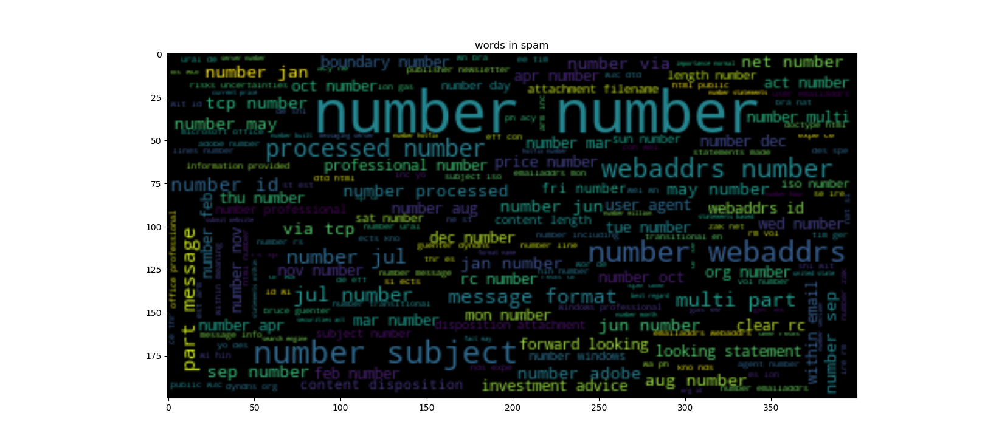

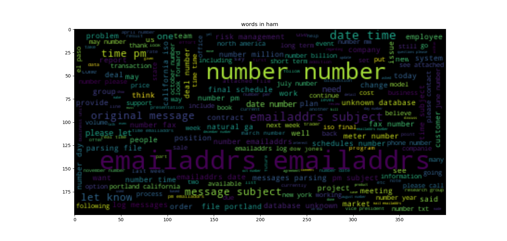

As we can see, the words such as 'Emailaddr' or 'Number' appeared alot in both datasets as we replace every E-mail address and number with these words.

We also plot the words based on their apperance count in the data:


```python
##### To get a unique list of words we use sets
set_hamWords = set(wordSorted_ham)
set_spamWords = set(wordSorted_spam)
set_BagOfWords = set(wordSorted[:BoW_size])

##### Words from our vocab that are only in spam E-mails not ham (distinctive words)
VocabWordsOnlyInSpam = (set_BagOfWords & set_spamWords) - (set_BagOfWords & set_hamWords)

##### Words from our vocab that are only in ham e-mails not spam (distinctive words)

VocabWordsOnlyInHam = (set_BagOfWords & set_hamWords) - (set_BagOfWords & set_spamWords)

print("intersection of bag of words with spam words excluding ham words : %d" % len(VocabWordsOnlyInSpam))
print("intersection of bag of words with ham words excluding spam words : %d" % len(VocabWordsOnlyInHam))
print("*"*5 + "words not included in ham files:")
print((set_BagOfWords & set_spamWords) - (set_BagOfWords & set_hamWords))
print("*"*5 + "words not included in spam files:")
print((set_BagOfWords & set_hamWords) - (set_BagOfWords & set_spamWords))

##### Here we print the words in our vocabulary with thier occurrence counts in spam/ham content 
print("words in bag ")
for i in range(BoW_size):
	vocabWord = wordSorted[i]
	probWordInSpam = vocab_spam.get(vocabWord,0)
	probWordInHam = vocab_ham.get(vocabWord,0)
	print("%10s\tSpam : %6d\tHam : %6d" %(vocabWord,probWordInSpam,probWordInHam))
#################################################################################
```

Next, we use python sets to see how the words intersect in ham and spam files with the most common words, as we have mentioned, we don't want the words in our bag of words which are only present in one of the classes. This would cause the classifier be overfitted only on Enron datasets. 
In the end, we print all words we have chosen in the bag of words with their corresponding count in the ham and spam data.


```python
########### Preparing the dataset for training the classifiers ##################
# Here we define the words to be used as features
# we a number of most common words , it can be thought as bag of words 
mostCommonWords = wordSorted[:BoW_size]

# Defining a dictionar whose keys are most common words and values are the indexes
vocab_indexing = {k:v for (v,k) in enumerate(mostCommonWords)} # 

# Tokenization : spliting the content of each file to list of words 
contentTokenized = []
for content in contentList:
	contentTokenized += [content.split()]

# Vectorization : Converting the words to integres using the most common words
contentVectorized = np.zeros((numOfSamples,BoW_size),dtype=np.int16)
for (row,content) in enumerate(contentTokenized):
	for word in content:
		word_index = vocab_indexing.get(word,0)
		contentVectorized[row,word_index]+=1	
#################################################################################

```

Next, we perform tokenization and vectorization for the bag of words approach: first we split the contents into words then the words are assigned an integer index from a python dictionary whose keys are words and values are the indexes.


```python
########### Splitting data into train, val, and test set ########################	
# Defining training (50%) validation (25%) and test set (25%) length

trainLength = int(0.5 * numOfSamples)
valLength   = int(0.25 * numOfSamples)
testLength  = numOfSamples - (trainLength + valLength)
print("total number of samples %d splitted to %d training samples and %d test samples" % (numOfSamples,trainLength,testLength))

train_data   	= contentVectorized[:trainLength]
train_label  	= lableList  	   [:trainLength]
val_data  	= contentVectorized[trainLength : trainLength+valLength]
val_label 	= lableList        [trainLength : trainLength+valLength]
test_data    	= contentVectorized[trainLength+valLength:]
test_label   	= lableList        [trainLength+valLength:]

numHam_train 	= train_label.count(0)
numSpam_train 	= train_label.count(1)
numHam_val 	= val_label.count(0)
numSpam_val 	= val_label.count(1)
numHam_test 	= test_label.count(0)
numSpam_test 	= test_label.count(1)


### Ploting how spam and ham distributed on training / val / test sets
width = 0.35
plt.bar(0, numHam_train , width, color='b')
plt.bar(0, numSpam_train, width,  bottom=numHam_train, color='r')

plt.bar(1, numHam_val , width, color='b',label='Ham')
plt.bar(1, numSpam_val, width,  bottom=numHam_val, color='r')

plt.bar(2, numHam_test , width, color='b',label='Ham')
plt.bar(2, numSpam_test, width,  bottom=numHam_test, color='r')
plt.xticks([0,1,2],['Training','Validation','Test'])

plt.ylabel('Number of E-mails')
plt.legend(['Ham','Spam'])
plt.title("Class distribution")
plt.show()
#################################################################################
```

Then, we split the dataset into trianing, validation, and test sets using a ratio of 50, 25, and 25 % respectively.
Next we plot how ham and spam classes are distributed in these datasets.

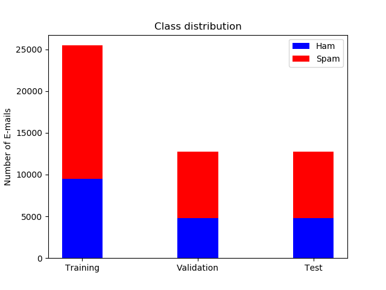


```python
########################################################################
##########     Naive Bayes Classifier       ############################
########################################################################

print("*** Multinomial Naive Bayes Classifer ***")
classifier = MultinomialNB()
classifier.fit(train_data, train_label)

prediction = classifier.predict(test_data) 
test_conf = computeConfMatrix(prediction,test_label)
test_metrics = performanceMetrics(test_conf)

predoction_prob = classifier.predict_proba(test_data)
FPR_NB ,TPR_NB = ROC(predoction_prob[:,1],test_label) 		

```

First classifaction approach is naive Bayes classifier, as its name implies it uses Bayes' theorem and with the assumption that the features (in our case selected words counts) are independent.
We used multinomial naive Bayes classifer where the probability distrution of each feature follows the multinomial distribution where we count number of words in our bag of words.
Although it is regarded as one of the simplest classifiers, it shows relatively good classification performance for text classifiation.

Same as all sklearn classifiers, first we fit the classfier on the training data then the classifier is applied over the test set. The predicted outputs and also the probabilities are then used to measure the performance metrics which will be seen in the following parts.


```python
########################################################################
##########     Decision Tree Classifier     ############################
########################################################################

print("*** Decision Tree Classifier ***")
classifier = DecisionTreeClassifier()
classifier.fit(train_data, train_label)

prediction = classifier.predict(test_data)
test_conf = computeConfMatrix(prediction,test_label)
test_metrics = performanceMetrics(test_conf)

predoction_prob = classifier.predict_proba(test_data)
FPR_DT ,TPR_DT = ROC(predoction_prob[:,1],test_label) 

```

Second classifer is decision tree, a decision tree construct a flow-chart structure (tree) in which each internal node assigned a test/rule on a feature, the two outgoing branches represnt the outcome of that test (true and flase) and in the end the leaf nodes determine the class of the data. During the trainig, these rules and their corresponding threshold are learned by a criterion by minimizing gini or entropy according to the representation of the tree.

Same as all sklearn classifiers, first we fit the classfier on the training data then the classifier is applied over the test set. The predicted outputs and also the probabilities are then used to measure the performance metrics which will be seen in the following parts. Probabilities here are just the fraction of training samples of the same class in a the leaf.


```python
########################################################################
##########        K-Nearest Neighbors       ############################
########################################################################

print("*** K-Nearest Neighbors Classifer ***")
classifier = KNeighborsClassifier()			
classifier.fit(train_data, train_label)
prediction = classifier.predict(test_data)
test_conf = computeConfMatrix(prediction,test_label)
test_metrics = performanceMetrics(test_conf)

predoction_prob = classifier.predict_proba(test_data)
FPR_KN ,TPR_KN = ROC(predoction_prob[:,1],test_label) 

```

K-Nearest Neighbors classifier is used next. The main idea behind nearest neighbor classifer is to find a number of training samples closest in distance to the test sample point, and predict the label from these training samples usually by measuring standard Euclidean distance. This approach can be regarded as non-generalizing machine learning method, since they simply memorize all of its training data during inference. 

Same as all sklearn classifiers, first we fit the classfier on the training data then the classifier is applied over the test set. The predicted outputs and also the probabilities are then used to measure the performance metrics which will be seen in the following parts. Probabilities here are just the fraction of nearest neighbors of the same class in k-nearest neighbors.


```python

########################################################################
##########  Logistic Regression Classifier  ############################
########################################################################
print("*** Logistic Regression Classifer ***")

# Data Loaders
batchSize = 32
train_loader = EnronBatchLoader(data = torch.Tensor(train_data)	,label = torch.Tensor(train_label)	,batchSize=batchSize	,shuffle=True)
val_loader   = EnronBatchLoader(data = torch.Tensor(val_data)	,label = torch.Tensor(val_label)	,batchSize=batchSize	,shuffle=False)
test_loader  = EnronBatchLoader(data = torch.Tensor(test_data)	,label = torch.Tensor(test_label)	,batchSize=batchSize	,shuffle=False)	

# Classifier

classifier = ClassifierLogisticRegression(batchSize = 32,outputSize = 1,   inputSize = BoW_size, device = 'cpu')
best_spamF1Score = 0
numEpoches_max = 1000
epoch = 0
# if perfromance dose not imporve for certain number of consecutive epoches stop the training
numEoches_stopCriteria = 10 
counter_stop = 0

while (epoch < numEpoches_max) and (counter_stop < numEoches_stopCriteria):
	# train 
	classifier.train(train_loader)
	# validation
	_,prediction = classifier.predict(val_loader)
	# confusion matrix
	val_conf = computeConfMatrix(prediction,val_label)
	# performance metrics
	val_metrics = performanceMetrics(val_conf)
	# if performance on val improves then save best model and reset the stop counter
	if val_metrics['f1Score_spam'] > best_spamF1Score:
		best_spamF1Score = val_metrics['f1Score_spam'] 
		counter_stop = 0
		classifier.saveWeights('bestModel_LL.pt')
	else:
		counter_stop += 1
	epoch += 1

# measure the performance of the best model on test set
classifier.loadWeights('bestModel_LL.pt')
predoction_prob, prediction = classifier.predict(test_loader)
test_conf = computeConfMatrix(prediction,test_label)
test_metrics = performanceMetrics(test_conf)
FPR_LR ,TPR_LR = ROC(np.array(predoction_prob),test_label) 

```

Then, we used logistic regression for the classification. Logistic regression is a linear classification model in which the probabilities are predicted using logistic function such as sigmoid.
We constrcut the model using fully connect layer in pytorch along with a sigmoid layer. 


For training, the model is trained for a number of epoches, for each epoch after the model is trained, its perfroamce is measure over the validation set. If the performance does not improved for a certain number of consecutive epochs, the training will be terminated. The weights of the model with the best performance on the validation set is used to measure the peroformance on the test set.


```python
########################################################################
##########        Long Short Term Memory    ############################
########################################################################
print("*** Long Short Term Memory Classifer ***")
# input data for lstm is extracted using a larger vocabulary which will then be embedded in lower dimentional space
# as lstm can accept input of different sizes, we will not use bag of words, instead word embedding will be utilized
content_lengths = []
for content in contentList:
	length = len(content.split())
	content_lengths += [length] 
maxLength = max(content_lengths)


# tokenization : split each content to a list of words
contentTokenized = [] # list of contents splitted into list of words
for content in contentList:
	contentTokenized += [content.split()]	


vocabSize = 8000
mostCommonWords = wordSorted[:vocabSize-2]
vocab_indexing = {k:v+2 for (v,k) in enumerate(mostCommonWords)} # 0 : pad, 1: unknown(not in vocab)


# indexing word in tokenized content

contentIndexed = [] # list of content:list of indexes	
for content in contentTokenized:
	c_indexed = []
	for word in content:
		word_index = vocab_indexing.get(word,1)
		c_indexed += [word_index]
	contentIndexed += [c_indexed]

# now padding zeros data tensor will have n_samples x maxLength size
content_tensor = torch.zeros((numOfSamples,maxLength)).long()

for index in range(numOfSamples):
	contentLength = content_lengths[index]
	content_tensor[index,:contentLength] = torch.LongTensor(contentIndexed[index])

content_lengths = torch.LongTensor(content_lengths)

print("maximum sequence length:%d" % maxLength)


# spliting train / val / test
#lableList = torch.Tensor(lableList)

train_data   = content_tensor[:trainLength]
train_label  =       lableList[:trainLength]
train_lengths= content_lengths[:trainLength]

val_data  = content_tensor[trainLength : trainLength+valLength]
val_label = lableList      [trainLength : trainLength+valLength]
val_lengths= content_lengths[trainLength : trainLength+valLength]

test_data  = content_tensor[trainLength+valLength:]
test_label = lableList      [trainLength+valLength:]
test_lengths= content_lengths[trainLength+valLength:]	
```

As it has been described in [LSTM classifier section](#-LSTM-Classifier), since LSTM can model sequnce with differnt length, for LSTM classifier we will use word embedding as the feature extraction part instead of bag of words approach. So the sequence length of each sample (number of words in each E-mail) is required as well during training.
Same as previous approaches, we tokenize and vectorize the content where E-mail contents is splitted into words and each word is given an index based on a vocabulary.
However, since the size of the LSTM input will not be defined by vocanulary size and it will be defined by the embedding dimensions, the size of vocabulary here is much larger compared to bag of words size used in previous approaches.
Then the sequence/content will be padded with zeros to form a tensor where the number of rows is the number of samples and the number of columns is the maximum lenght of the contents (maximum words in the E-mail in the dataset). As is described in the [pre-processing section](#-Pre-processing), the muximum words in an E-mail is set to be 1000 words.
Then such tensor is splitted to training, validation and test sets.


```python
# LSTM

# Loaders

batchSize = 256
train_loader = EnronBatchLoader(data=train_data	,label=torch.Tensor(train_label),seqLengths=train_lengths	,batchSize=batchSize,shuffle=True	,LSTM=True)
val_loader   = EnronBatchLoader(data=val_data	,label=torch.Tensor(val_label)	,seqLengths=val_lengths		,batchSize=batchSize,shuffle=False	,LSTM=True)
test_loader  = EnronBatchLoader(data=test_data,	label=torch.Tensor(test_label)	,seqLengths=test_lengths	,batchSize=batchSize,shuffle=False	,LSTM=True)


# classfier

classifier = ClassifierLSTM(batchSize = batchSize,train_data = train_data,val_data = val_data,test_data = test_data,\
		train_label = train_label,val_label = val_label,test_label=test_label,\
		train_lengths = train_lengths, val_lengths = val_lengths, test_lengths = test_lengths,\
		outputSize = 1, numLayers = 2, hiddenSize = 64, embedSize = 512, vocabSize = vocabSize,\
		device = 'cpu')

best_spamF1Score = 0
numEpoches_max = 1000
epoch = 0
# if perfromance dose not imporve for certain number of consecutive epoches stop the training
numEoches_stopCriteria = 10 
counter_stop = 0

while (epoch < numEpoches_max) and (counter_stop < numEoches_stopCriteria):
	# train 
	prediction = classifier.train(train_loader)
	# validation
	_,prediction,labels = classifier.predict(val_loader)
	# confusion matrix
	val_conf = computeConfMatrix(prediction,labels)
	# performance metrics
	val_metrics = performanceMetrics(val_conf)
	# if performance on val improves then save best model and reset the stop counter
	if val_metrics['f1Score_spam'] > best_spamF1Score:
		best_spamF1Score = val_metrics['f1Score_spam'] 
		counter_stop = 0
		classifier.saveWeights('bestModel_LSTM.pt')
	else:
		counter_stop += 1
	epoch += 1

# measure the performance of the best model on test set
classifier.loadWeights('bestModel_LSTM.pt')
predoction_prob,prediction,labels  = classifier.predict(test_loader)
test_conf = computeConfMatrix(prediction,labels)
test_metrics = performanceMetrics(test_conf)
FPR_LSTM ,TPR_LSTM = ROC(np.array(predoction_prob),labels) 

```

Same as logistic regression model, during training, the model is trained for a number of epoches where in each epoch after the model is trained, its perfroamce is measure over the validation set. If the performance does not improved for a certain number of consecutive epochs, the training will be terminated. The weights of the model with the best performance on the validation set is used to measure the peroformance on the test set.


```python 
 # Plotting ROC curve #
plt.plot(FPR_NB,TPR_NB,label='Multinomial Naive Bayes',linewidth = 2)
plt.plot(FPR_DT,TPR_DT,label='Decision Tree',linewidth = 2)
plt.plot(FPR_KN,TPR_KN,label='K-Nearest Neighbors',linewidth = 2)
plt.plot(FPR_LR,TPR_LR,label='Logistic Regression',linewidth = 2)
plt.plot(FPR_LSTM,TPR_LSTM,label='LSTM',linewidth = 2)
plt.legend(loc='lower right')
plt.ylabel("True Positive Rate")
plt.xlabel("False Positive Rate")
plt.xlim([-0.01,0.4])
plt.ylim([0.6,1.01])
plt.show()
```


At the end, we compare the resuts of different methods over the ROC curves.


